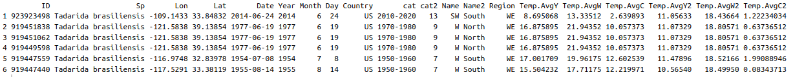

# Data

The main data used in this article is [Occurences_Tb_TempPeriods_FINAL.csv](https://github.com/oleon12/Tbrasiliensis_USrange/edit/main/Data/Occurences_Tb_TempPeriods_FINAL.csv), the other file is just a variation. This CSV file contains different columns with the follwoing information:

- **Identification:** The identification of each record. This is the GBIF ID number (*ID*) and the species name (*Sp*)
- **Space:** The coordinates colums in decimal format (*Lon*, *Lat*), along with the country (*Country*), and the specific region (East, West, and Middel U.S.) where each point overlap (*Region*)
- **Time:** The date where the record was taken. This inclued *Date*, *Year*, *Month*, and *Day*. Likewise, this information includes the period time or decade of each point (*cat*) which is also represetend by a sequences of numbers (*cat2*). 

 

  

