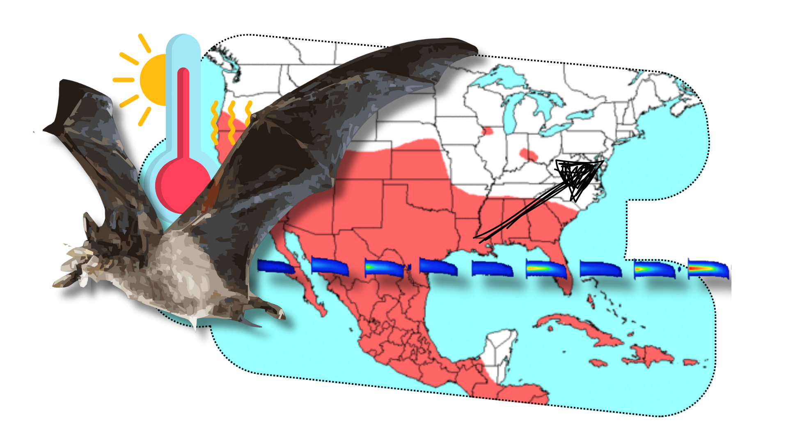

# Climate-driven range expansion in the Brazilian free-tailed bat (Tadarida brasiliensis) in North America.

This repository contains the data and R scripts used in the study

- **Data:** Here you can find all the data generated and used in the study. A [README](https://github.com/oleon12/Tbrasiliensis_USrange/blob/main/Data/README.md) file explains the content of each file.
- **R:** Here you can find all the scripts created and used in the study. A [README](https://github.com/oleon12/Tbrasiliensis_USrange/blob/main/R/README.md) file explains the content and use of each R script.

---

  

---
