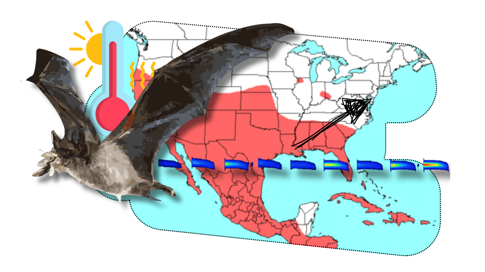
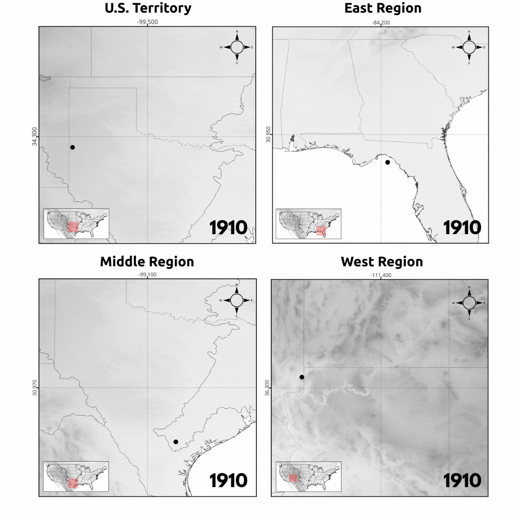

# Warming temperatures lead to range expansion of the Brazilian free-tailed bat (<i>Tadarida brasiliensis</i>) in North America.
#### [Omar Daniel Leon-Alvarado](https://www.researchgate.net/profile/Omar-Leon-Alvarado?ev=hdr_xprf); Kamil Kozlowski, [J. Angel Soto-Centeno](https://www.researchgate.net/profile/J-Soto-Centeno)

This repository contains the data and R scripts used in the study

- **Data:** Here you can find all the data generated and used in the study. A [README](https://github.com/oleon12/Tbrasiliensis_USrange/blob/main/Data/README.md) file explains the content of each file.
- **R:** Here you can find all the scripts created and used in the study. A [README](https://github.com/oleon12/Tbrasiliensis_USrange/blob/main/R/README.md) file explains the content and use of each R script.

---

  

---

Spatiotemporal dynamics of the geographic centroid of Tadarida brasiliensis across the U.S. and three regional divisions (East, Middle, West).

 

  

